# AceTree Image-Analysis and Tracking Pipeline Specification

- **Status:** Prototype implemented; full workflow contract proposed
- **Specification version:** `1.0.0-alpha.1`
- **Implemented component API:** `1.0` (strict major-version negotiation)
- **Implemented sidecar schema:** `acetree.tracking-proposal`, version `1`

**Applies to:** dataset creation, global automated tracking, and selected-cell
forward tracking

This document defines the architecture and behavioral contract for adding
modular image detection and tracking to AceTree-Py. It is deliberately more
strict than an implementation sketch: compatible components must obey the
coordinate, lifecycle, validation, review, commit, and persistence rules below.

The first reference implementation will provide independent SciPy-based
Laplacian-of-Gaussian (LoG) and Difference-of-Gaussian (DoG) detectors and a
simple Linear Assignment Problem (LAP) linker. The same contracts are intended
to support learned detectors, external executables, TrackMate interchange, and
eventually a backward-compatible StarryNite replacement.

### Implemented prototype profile (July 2026)

The repository currently implements the immutable physical-coordinate values,
component registry, SciPy LoG/DoG detectors, Simple LAP tracker, global creation
option, selected-forward local search, stale-preview check, atomic proposal
command, exact undo/redo, single-latest-run JSON sidecar, and a modeless Auto
Forward review workbench described here. Selected-forward drafts appear in
dedicated read-only napari position/link layers, including positions created by
gap interpolation; users can navigate time and Z, adjust parameters, rerun,
cancel between frames, accept, or discard. The richer
`acetree.tracking/v1alpha1` request envelope, background worker, global review
workbench, multi-run transactional provenance ledger, division-aware tracker,
and TrackMate/StarryNite adapters remain staged requirements. Sections that
describe those pieces are the target contract, not claims about current code.
The implemented Python interfaces in `acetree_py/tracking/api.py` are the
authoritative prototype wire shape until the alpha envelope is ratified.

## 1. Normative language

The words **MUST**, **MUST NOT**, **SHOULD**, **SHOULD NOT**, and **MAY** are
normative requirements. “Host” means AceTree-Py. “Component” means an installed
detector or tracker. “Pipeline” means a detector followed by a tracker and host
validation. “Document” means the current nuclei record plus its edit history
and accepted tracking provenance.

## 2. Goals and non-goals

### 2.1 Goals

1. Let a user choose **Manual** or **Automated** initial tracking while creating
   a dataset without making automation mandatory.
2. Let a user run a detector and tracker globally, preview the proposal, and
   accept it as one undoable edit.
3. Let a user select a concrete nucleus and track only that cell forward,
   stopping safely when the result becomes uncertain.
4. Discover independently installed detector and tracker packages without
   coupling their code to Qt, napari, naming, or legacy persistence.
5. Keep the nuclei ZIP, XML configuration, and AuxInfo behavior backward
   compatible.
6. Preserve forced names and allow the existing naming pipeline to name newly
   accepted automatic tracks.
7. Record enough provenance to reproduce or audit every automated proposal.
8. Provide an adapter boundary that can later host a StarryNite-compatible
   pipeline without creating a second editing or persistence path.

### 2.2 Non-goals for v1

- Reimplementing all TrackMate algorithms or loading TrackMate Java plugins.
- Automatically replacing manually curated nuclei.
- Silently committing a result because a pipeline completed successfully.
- Solving embryo-wide division assignment in the prototype simple LAP linker.
- Storing plugin-specific fields in the fixed legacy nuclei CSV columns.
- Making a tracking plugin responsible for Sulston naming or body-axis logic.

## 3. Design principles

1. **Propose, inspect, commit.** Analysis produces an immutable proposal. Only
   explicit user acceptance mutates the document.
2. **Manual work wins.** A pipeline never overwrites a forced name and defaults
   to preserving every existing live nucleus.
3. **Physical identity, not mutable names.** Selected-forward tracking starts
   from a `(time, index)` nucleus anchor, never from a display name.
4. **One user action, one history command.** Accepting a proposal is atomic and
   undoable in one step.
5. **Detection and linking are separate.** Their settings, versions, failures,
   and replaceability remain independent.
6. **Headless core, thin GUI.** Components depend on the tracking API and image
   source protocols, not on Qt, napari, `AceTreeApp`, or `NucleiManager`.
7. **Legacy data remains authoritative.** The accepted lineage remains readable
   as a standard AceTree/StarryNite nuclei ZIP even if all plugins and the
   provenance sidecar are absent.
8. **Uncertainty is visible.** Low-confidence, ambiguous, truncated, and
   conflicting results are surfaced rather than normalized away.
9. **Determinism by default.** Identical input, settings, and component versions
   must yield identical detection IDs, ordering, assignments, and proposal
   hashes unless a component declares and records a random seed.

## 4. Architecture

```mermaid
flowchart LR
    UI["Dataset wizard or Tracking panel"] --> CTRL["TrackingController"]
    CTRL --> REG["ComponentRegistry"]
    CTRL --> RUN["PipelineRunner (worker)"]
    REG --> DET["Detector plugin"]
    REG --> TRK["Tracker plugin"]
    IMG["Worker-local ImageSource"] --> DET
    DET --> SPOTS["DetectionSet"]
    SPOTS --> TRK
    TRK --> GRAPH["TrackGraph"]
    GRAPH --> VAL["Host validator and materializer"]
    VAL --> PROP["Immutable TrackingProposal"]
    PROP --> PREVIEW["napari preview layers"]
    PREVIEW -->|Accept| CMD["ApplyTrackingProposal command"]
    PREVIEW -->|Cancel| DISCARD["Discard proposal"]
    CMD --> HIST["EditHistory"]
    HIST --> MODEL["NucleiManager + naming + lineage rebuild"]
    MODEL --> SAVE["ZIP + AuxInfo + tracking provenance transaction"]
```



Recommended package layout:

```text
acetree_py/tracking/
  api.py                   # versioned values, protocols, errors
  registry.py              # built-ins + installed entry points
  pipeline.py              # orchestration, progress, cancellation
  validation.py            # graph and document conflict checks
  materialize.py           # proposal -> deterministic document delta
  persistence.py           # versioned provenance sidecar
  detectors/log_dog.py     # independent SciPy LoG/DoG implementation
  trackers/lap.py          # independent SciPy LAP implementation
  adapters/trackmate.py    # interchange only
  adapters/starrynite.py   # future external/native implementation bridge

acetree_py/gui/
  tracking_panel.py        # global + selected-forward controls
  tracking_controller.py   # workers, signals, preview, accept/cancel
```

## 5. Versioned public API

### 5.1 Compatibility rules

- Every serialized request, proposal, and sidecar MUST contain
  `api_version: "acetree.tracking/v1alpha1"`.
- A component descriptor MUST declare every API major version it supports.
- The host MUST reject an unsupported major version before loading the
  component factory.
- Additive optional fields are allowed within `v1alpha1`. Removing a field,
  changing units, changing an enum meaning, or weakening an invariant requires
  a new API version.
- Unknown fields in settings, features, proposals, and provenance MUST be
  preserved when round-tripping JSON, but a component MAY reject unknown
  settings through its settings schema.
- All public values crossing the plugin boundary MUST be immutable values or
  read-only protocols. Components MUST NOT retain mutable host model objects.

### 5.2 Core value types

The following is the normative shape; implementation may use frozen dataclasses,
typed dictionaries, or equivalent immutable values.

```python
ApiVersion = Literal["acetree.tracking/v1alpha1"]
JsonValue = None | bool | int | float | str | list["JsonValue"] | dict[str, "JsonValue"]

@dataclass(frozen=True)
class TimeRange:
    start: int                 # inclusive, AceTree 1-based time
    end: int                   # inclusive, end >= start

@dataclass(frozen=True)
class Calibration:
    xy_um: float               # microns per XY pixel, finite and > 0
    z_um: float                # microns per Z plane, finite and > 0
    plane_start: int = 1

@dataclass(frozen=True)
class Detection:
    detection_id: str          # unique and stable within the proposal
    frame: int                 # AceTree 1-based time
    x_um: float                # calibrated physical position, finite
    y_um: float
    z_um: float
    radius_um: float           # finite and > 0
    quality: float             # finite; larger means better
    features: Mapping[str, JsonValue] = field(default_factory=dict)

class EdgeKind(str, Enum):
    LINK = "link"
    SPLIT = "split"
    GAP = "gap"

@dataclass(frozen=True)
class TrackEdge:
    source_id: str
    target_id: str
    kind: EdgeKind
    cost: float                # finite and >= 0
    features: Mapping[str, JsonValue] = field(default_factory=dict)

@dataclass(frozen=True)
class NucleusAnchor:
    time: int
    index: int
    x_px: int                  # snapshot used for stale-seed detection
    y_px: int
    z_plane: float
    assigned_id: str

class TrackingScope(str, Enum):
    GLOBAL = "global"
    SELECTED_FORWARD = "selected_forward"

class BranchPolicy(str, Enum):
    STOP = "stop"             # required prototype default
    FOLLOW_BEST = "follow_best"
    FOLLOW_BOTH = "follow_both"

class ConflictPolicy(str, Enum):
    PRESERVE_EXISTING = "preserve_existing"
    REPLACE_PIPELINE_OWNED = "replace_pipeline_owned"
    REPLACE_ALL_IN_RANGE = "replace_all_in_range"

@dataclass(frozen=True)
class ComponentRef:
    id: str                    # namespaced stable ID
    version: str               # installed component version
    settings: Mapping[str, JsonValue]

@dataclass(frozen=True)
class TrackingRequest:
    api_version: ApiVersion
    request_id: str            # UUID
    scope: TrackingScope
    time_range: TimeRange
    channel: int               # ImageProvider 0-based channel
    calibration: Calibration
    detector: ComponentRef
    tracker: ComponentRef
    baseline_revision: str
    image_fingerprint: str
    seed: NucleusAnchor | None
    branch_policy: BranchPolicy
    conflict_policy: ConflictPolicy
    random_seed: int | None
```

Global requests MUST have `seed=None`. Selected-forward requests MUST have a
live seed and `time_range.start == seed.time`. `REPLACE_ALL_IN_RANGE` MUST NOT be
the default and MUST require a separate destructive confirmation in the GUI.

### 5.3 Image source contract

```python
class TrackingImageSource(Protocol):
    @property
    def num_timepoints(self) -> int: ...
    @property
    def num_planes(self) -> int: ...
    @property
    def num_channels(self) -> int: ...
    @property
    def image_shape(self) -> tuple[int, int]: ...
    @property
    def calibration(self) -> Calibration: ...
    def get_stack(self, time: int, channel: int = 0) -> np.ndarray: ...
    def fingerprint(self) -> str: ...
    def close(self) -> None: ...
```

`get_stack()` returns `(Z, Y, X)`. Time and Z-plane coordinates are 1-based in
the tracking API; array indices and channels are 0-based. The host MUST provide
a worker-local image source. The current TIFF providers cache mutable open
handles, so the GUI's provider MUST NOT be shared with a tracking worker.

The fingerprint SHOULD include normalized image paths or object IDs, file size
and modification metadata where available, dimensions, channel layout, and
calibration. It MUST NOT require hashing every image byte before interactive
work can begin. A full content hash MAY be recorded by batch workflows.

### 5.4 Progress and cancellation

```python
@dataclass(frozen=True)
class ProgressEvent:
    phase: Literal["loading", "detecting", "linking", "validating", "materializing"]
    completed: int
    total: int | None
    message: str

class CancellationToken(Protocol):
    def is_cancelled(self) -> bool: ...
    def raise_if_cancelled(self) -> None: ...
```

Components MUST check cancellation at least once per image timepoint and before
starting a potentially large assignment solve. Progress is advisory, monotonic
within a phase, and delivered by the controller to the GUI thread. Components
MUST NOT call Qt, napari, or mutate the document.

Cancellation produces no committable partial proposal. Diagnostic partial
counts MAY be shown in the UI but MUST NOT be accepted. A component exception
has the same no-mutation guarantee.

### 5.5 Component descriptors and factories

```python
@dataclass(frozen=True)
class ComponentCapabilities:
    dimensions: frozenset[Literal["2d", "3d"]]
    scopes: frozenset[TrackingScope]
    supports_multichannel: bool
    supports_gaps: bool
    supports_divisions: bool
    supports_merges: bool
    deterministic: bool

@dataclass(frozen=True)
class ComponentDescriptor:
    id: str                    # e.g. "org.acetree.detector.log"
    display_name: str
    component_type: Literal["detector", "tracker"]
    component_version: str
    supported_api_versions: tuple[str, ...]
    capabilities: ComponentCapabilities
    settings_schema: Mapping[str, JsonValue]  # JSON Schema 2020-12
    documentation_url: str | None
    distribution_name: str
    distribution_version: str
    license_expression: str | None

class Detector(Protocol):
    descriptor: ComponentDescriptor
    def detect(
        self,
        source: TrackingImageSource,
        request: TrackingRequest,
        cancel: CancellationToken,
        progress: Callable[[ProgressEvent], None],
    ) -> Sequence[Detection]: ...

class Tracker(Protocol):
    descriptor: ComponentDescriptor
    def link(
        self,
        detections: Sequence[Detection],
        request: TrackingRequest,
        cancel: CancellationToken,
        progress: Callable[[ProgressEvent], None],
    ) -> Sequence[TrackEdge]: ...
```

In the implemented component API, an entry point exposes or returns a
`PluginContribution(descriptor, factory)`. The zero-argument component factory
then returns a detector with `detect(...)` or a tracker with `track(...)`. This
keeps descriptor/API validation ahead of component execution.

## 6. Plugin discovery and installation

AceTree uses standard Python package entry points, as specified by the
[PyPA entry-points specification](https://packaging.python.org/en/latest/specifications/entry-points/)
and discovered with
[`importlib.metadata.entry_points`](https://docs.python.org/3/library/importlib.metadata.html#entry-points).

The entry-point groups are:

```toml
[project.entry-points."acetree_py.tracking.detectors"]
my_detector = "my_package.detector:contribution"

[project.entry-points."acetree_py.tracking.trackers"]
my_tracker = "my_package.tracker:contribution"
```

Rules:

1. Built-in LoG, DoG, and LAP components are registered explicitly so they also
   work from source and editable installations.
2. The prototype discovers contribution metadata when the default registry is
   first built and instantiates a component only when selected. A future
   marketplace-scale registry SHOULD discover metadata without importing every
   implementation package.
3. An entry-point import or descriptor error is isolated in
   `discovery_errors` and does not prevent built-ins or other plugins from
   loading.
4. Duplicate component IDs are reported as discovery errors. Before a public
   plugin ecosystem is declared stable, conflicting IDs SHOULD disable both
   external contributions and show their owning distributions instead of
   relying on discovery order.
5. The dataset stores component ID, version, distribution, license metadata,
   and settings. A missing component remains visible as “Unavailable”; its
   settings MUST be preserved.
   In the prototype, install a trusted distribution into AceTree's Python
   environment and restart; its contribution then appears in both selectors.
6. The core does not install packages automatically. A future UI provides
   “How to install” guidance and “Refresh installed components.” A future
   managed installer MAY invoke an environment manager only after explicit
   consent and must show the package source and target environment.
7. Third-party components execute with the user's process permissions. The UI
   MUST state that installed plugins are trusted code. Future external-process
   adapters MAY add isolation, but entry points are not a sandbox.

## 7. Proposal model

```python
class ProposalStatus(str, Enum):
    READY = "ready"
    READY_WITH_WARNINGS = "ready_with_warnings"
    STALE = "stale"
    CANCELLED = "cancelled"
    FAILED = "failed"

@dataclass(frozen=True)
class ProposalConflict:
    code: str
    severity: Literal["info", "warning", "blocking"]
    message: str
    proposed_ids: tuple[str, ...]
    existing_anchors: tuple[tuple[int, int], ...]
    resolutions: tuple[str, ...]

@dataclass(frozen=True)
class TrackingProposal:
    api_version: ApiVersion
    proposal_id: str
    request: TrackingRequest
    detections: tuple[Detection, ...]
    edges: tuple[TrackEdge, ...]
    conflicts: tuple[ProposalConflict, ...]
    warnings: tuple[str, ...]
    metrics: Mapping[str, JsonValue]
    detector_provenance: ComponentDescriptor
    tracker_provenance: ComponentDescriptor
    created_at_utc: str
    proposal_hash: str
    status: ProposalStatus
```

The proposal hash is computed from canonical JSON containing the request,
detections, edges, component identities, and input fingerprint. Timestamps and
GUI-only state are excluded. Detection and edge ordering is canonical:
detections by `(time, id)`, edges by `(source_id, target_id, kind)`.

Analysis and preview MUST NOT mutate `nuclei_record`, lineage trees, naming,
edit history, dirty state, selection, AuxInfo, or persistent files.

## 8. Host validation and materialization

Validation occurs after component output and before preview, then again against
the live document immediately before commit.

### 8.1 Geometry and value validation

- Every detection ID is non-empty and unique.
- All coordinates, diameter, quality, and costs are finite.
- Time lies inside the request and dataset range.
- `diameter_px > 0`; committed diameter is at least one pixel.
- X/Y lie inside the image. Z lies in `[1, num_planes]`, allowing a small
  configurable localization tolerance only during proposal generation.
- Every edge references existing detections and advances time.
- Self edges and directed cycles are forbidden.

### 8.2 AceTree lineage validation

The persistent AceTree model allows one predecessor and at most two successors.
Therefore:

- A proposed target MUST have at most one incoming edge.
- A proposed source MUST have at most two outgoing edges.
- Merge events are blocking even if a tracker claims merge support.
- Three or more daughters are blocking.
- An adjacent edge maps directly to the target nucleus's predecessor.
- A gap edge MUST be materialized as a contiguous series of intermediate
  nuclei before persistence. The interpolated or component-supplied points are
  listed explicitly in the preview and provenance.
- Dead existing nuclei do not satisfy a live predecessor edge.
- Reciprocal successor fields are rebuilt by the host; plugins do not supply
  persistent successor indices.

### 8.3 Coordinate conversion at commit

The proposal retains subpixel values. Materialization converts to legacy
fields deterministically:

```text
x              = round_half_away_from_zero(x_px)
y              = round_half_away_from_zero(y_px)
z              = z_plane                         # float retained
size           = max(1, round_half_away_from_zero(diameter_px))
status         = 1
identity       = ""
assigned_id    = ""
predecessor    = materialized prior-frame index or -1
```

Python's banker rounding MUST NOT be used because it makes `.5` behavior less
obvious in cross-language compatibility tests.

### 8.4 Conflict policies

`PRESERVE_EXISTING` is the default for every scope.

- Existing live nuclei are immutable constraints.
- A selected seed is reused, not duplicated.
- A proposed detection within an existing nucleus's configured overlap radius
  is reported as a conflict, not silently deduplicated.
- Existing forced names (`assigned_id`) are always preserved, under every
  pipeline conflict policy.
- Existing links involving preserved nuclei may only be extended when the
  resulting edge is unambiguous and passes the one-parent/two-child rules.

`REPLACE_PIPELINE_OWNED` may replace only nuclei recorded as outputs of a prior
accepted run in the provenance sidecar and not subsequently manually edited.
If ownership or edit status is uncertain, preserve and report a conflict.

`REPLACE_ALL_IN_RANGE` may kill/replace live automatic nuclei only after an
explicit destructive confirmation summarizing counts and time range. It still
MUST NOT overwrite forced names; a forced-name collision is blocking.

### 8.5 Naming behavior

New detections are structural observations, not biological names. Components
MUST NOT set `identity` or `assigned_id`. After the structural commit, the host
runs its normal successor reconstruction, automatic naming, and lineage build
exactly once. This allows a forced parent such as EMS and a manual body frame to
drive automatic E/MS and Ea/Ep naming without making the tracking component
embryo-specific.

## 9. Preview and review

The GUI displays proposals in separate napari layers, visually distinct from
accepted nuclei:

- proposed detections: cyan;
- proposed links: cyan;
- low confidence: yellow;
- conflicts: red;
- interpolated gap points: dashed or hollow;
- existing/manual constraints: normal AceTree overlay.

The review panel MUST show detector/tracker and versions, settings summary,
time/channel/scope, proposed spot and track counts, gaps, stopped tracks,
warnings, blocking conflicts, and the document revision analyzed.

The user can scrub time and Z without changing the proposal. Previewing is not
an editing mode and must not capture the existing Add, Relink, or Manual Track
mouse gestures. Closing or cancelling review removes preview layers and makes
no document change.

The implemented selected-forward workbench uses cyan hollow positions and
incoming links, amber interpolated gap positions/links, and amber styling for
an out-of-date or stale draft. Its table provides a text equivalent for every
color, along with actual frame span, position/link/gap counts, human-readable
stop guidance, and direct navigation to each position or stopping frame.
Changing a parameter retains the prior overlay for comparison but disables
acceptance until the updated preview completes.

The first implementation accepts or rejects the whole proposal. Later versions
MAY support selecting individual tracks or a subrange, but the accepted subset
must be revalidated and assigned a new proposal hash.

## 10. Commit, undo, and document staleness

### 10.1 Revision semantics

Edit history exposes an opaque `document_revision`. Every successful do, undo,
or redo transitions to another revision; marking saved does not change it. A
request captures the baseline revision. A proposal is stale when:

- the current revision differs from the request baseline;
- the image fingerprint or calibration changed;
- the seed nucleus is missing, dead, moved, resized, renamed manually, or has
  different links from its captured anchor snapshot;
- a component required by the proposal is no longer the recorded version.

The implemented Auto Forward session additionally captures EditHistory's
monotonic `change_counter`. The current-state revision may legitimately return
to an earlier token after Undo; the counter ensures an intervening edit followed
by Undo cannot silently make an already-open draft acceptable again.

Stale proposals remain viewable but cannot be accepted. v1 does not
automatically rebase them. The UI offers **Rerun with current data**. A later
additive-only rebase MAY be introduced as a separately specified operation.

### 10.2 Atomic commit

Accepting a ready proposal performs this sequence:

1. Recheck revision, image fingerprint, seed, and all conflicts.
2. Build a deterministic materialization plan without mutation.
3. Capture exact undo state for every touched nucleus, link, timepoint, and
   provenance entry.
4. Execute one structural `ApplyTrackingProposal` command.
5. On any failure, roll back the command completely and keep the proposal open.
6. Rebuild successors, automatic identities, and the lineage tree once.
7. Preserve or re-resolve GUI selection through its physical anchor.
8. Push one history entry and mark the document dirty.

Undo restores the exact prior nuclei record and provenance ownership state.
Redo reapplies the same materialization plan; it does not rerun a detector or
tracker. A successful commit never writes files immediately; normal Save
persists the new document transactionally.

## 11. Workflow specifications

### 11.1 Dataset creation: Manual

1. User selects images, channel layout, calibration, and output location.
2. On **Initial tracking**, user selects **Manual** (default).
3. AceTree writes a valid empty nuclei ZIP and XML config and launches normally.
4. The existing Add and Manual Track tools remain unchanged.

No tracking plugin is required or loaded in this path.

### 11.2 Dataset creation: Automated global proposal

1. User selects **Automated** on the Initial tracking page.
2. The page lists compatible installed detectors and trackers.
3. The user chooses a channel and settings. Settings are generated from each
   component's JSON Schema and validated before **Create** is enabled.
4. AceTree first creates a valid empty dataset and launches it. Failure or
   cancellation therefore leaves a usable manual dataset.
5. A worker-local image source runs detection and linking with visible progress
   and cancellation.
6. Results are host-validated and opened as a proposal preview.
7. The user inspects across frames and chooses **Accept** or **Discard**.
8. Accept creates one undoable edit. Save is still explicit.

The wizard MUST remember selected settings for the session but MUST NOT suggest
that the result has been saved merely because analysis completed.

### 11.3 Existing dataset: Global proposal

The Tracking panel offers **Run globally…**. Default conflict policy is
`PRESERVE_EXISTING`, so it can populate empty frames or propose independent
tracks without replacing curated work. Replacement policies live under an
advanced disclosure and show a destructive confirmation.

### 11.4 Selected-cell forward tracking

1. User right-clicks/selects a concrete live nucleus.
2. User chooses **Track selected forward…** in the Tracking panel. This is
   distinct from the existing **Manual Track** button.
3. The host captures the physical seed anchor, current revision, and seed state.
4. User chooses end time, channel, detector, tracker, ROI radius, maximum
   displacement, and branch policy.
5. The seed is a fixed observation. It is not redetected or duplicated.
6. At each later frame, detection is restricted to an ROI centered on a
   motion prediction. The prototype uses last position or constant velocity.
7. LAP links the seed/frontier only to candidates in this local request. The
   pipeline MUST NOT populate unrelated global nuclei as a side effect.
8. Tracking stops at the first missing, gated-out, ambiguous, conflicting, or
   division-like transition under the default `BranchPolicy.STOP`.
9. The preview explains why and where it stopped. Accepted points extend the
   selected lineage and retain the parent continuation's manual naming state
   through the normal host naming rules.

This workflow aligns conceptually with TrackMate's documented
[semi-automatic tracking tool](https://imagej.net/plugins/trackmate/tutorials/manual-tracking),
but its implementation and AceTree-specific safety rules are independent.

Ambiguity is defined by configurable absolute cost and cost-margin thresholds.
If the best and second-best candidates differ by less than the margin, the
pipeline stops instead of guessing. Later `FOLLOW_BEST` and `FOLLOW_BOTH`
policies require explicit user selection and division-capable components.

## 12. Reference LoG/DoG detector

The detector is an independent implementation using the documented SciPy
primitives
[`scipy.ndimage.gaussian_laplace`](https://docs.scipy.org/doc/scipy/reference/generated/scipy.ndimage.gaussian_laplace.html)
and `gaussian_filter`. It does not copy TrackMate implementation code.

Required settings:

| Setting | Type | Meaning |
|---|---:|---|
| `method` | string enum: `log`, `dog` | Filter family |
| `expected_diameter_px` | float > 0 | Expected XY nuclear diameter |
| `threshold` | float >= 0 | Minimum normalized response |
| `min_separation_px` | float > 0 | Nonmaximum suppression distance |
| `bright_on_dark` | bool | Response polarity |
| `background_sigma_px` | float >= 0 | Optional broad background subtraction |
| `subpixel_localization` | bool | Local quadratic refinement |
| `exclude_border_px` | float >= 0 | Border exclusion |

Normative behavior:

1. Convert input to floating point without changing the source array.
2. Apply optional background subtraction and polarity normalization.
3. Use anisotropic sigma in `(Z,Y,X)` derived from physical calibration.
4. LoG uses negative scale-normalized response for bright objects. DoG uses
   the difference of two Gaussian scales with a documented scale ratio.
5. Find local maxima, apply threshold, then deterministic nonmaximum
   suppression in descending `(quality, -time, -z, -y, -x)` order.
6. Emit positive quality where larger is better, consistent with the
   [TrackMate spot model](https://imagej.net/plugins/trackmate/detectors/).
7. Detection IDs derive from request ID, frame, canonical rank, and coordinates;
   they do not depend on Python object identity.
8. Selected-forward detection crops a bounded ROI but returns coordinates in
   the full image coordinate system.

The prototype may use a single expected scale. Multi-scale scale-space
selection is a later compatible extension.

## 13. Reference simple LAP tracker

The reference linker independently uses
[`scipy.optimize.linear_sum_assignment`](https://docs.scipy.org/doc/scipy/reference/generated/scipy.optimize.linear_sum_assignment.html).
Its behavior is inspired by the public Simple LAP concept: squared distance,
gating, and no split/merge handling. The official
[TrackMate LAP documentation](https://imagej.net/plugins/trackmate/trackers/lap-trackers)
describes that conceptual distinction.

Required settings:

| Setting | Type | Meaning |
|---|---:|---|
| `max_link_distance_um` | float > 0 | Adjacent-frame hard gate |
| `birth_cost` | float > 0 | Dummy assignment for new tracks |
| `death_cost` | float > 0 | Dummy assignment for ended tracks |
| `max_frame_gap` | int >= 0 | Optional gap closure limit |
| `gap_distance_um` | float > 0 | Gap-closing hard gate |
| `size_penalty_weight` | float >= 0 | Relative diameter-change penalty |
| `quality_penalty_weight` | float >= 0 | Optional quality penalty |

Base adjacent-link cost:

```text
d2 = dx_um^2 + dy_um^2 + dz_um^2
cost = d2
     + size_penalty_weight * log(diameter_target / diameter_source)^2
     + quality_penalty_weight * normalized_quality_penalty
```

Pairs beyond the distance gate are forbidden rather than assigned an arbitrary
large finite preference. Birth and death dummy assignments make unmatched
spots explicit. Ties are broken by canonical detection ID so repeated runs are
stable.

Prototype capabilities are continuations, births, deaths, and optional gap
closing. It declares `supports_divisions=False` and `supports_merges=False`.
Division-like candidate patterns are warnings in global mode and stopping
events in selected-forward mode. A later lineage-aware LAP component can add
two-child division hypotheses without changing the proposal model.

## 14. TrackMate alignment and licensing boundary

TrackMate is useful as a conceptual and interchange reference because it
separates detectors from trackers, models detections as spots with coordinates,
radius, quality, and features, uses settings maps, and supports preview/manual
correction. Its official project describes this modular approach and
detector/linker separation in the
[TrackMate documentation](https://imagej.net/plugins/trackmate/) and
[official repository](https://github.com/trackmate-sc/TrackMate).

### 14.1 Licensing decision

TrackMate is distributed under GPL-3.0, as stated by its
[official repository and license](https://github.com/trackmate-sc/TrackMate/blob/master/LICENSE.txt).
AceTree-Py is MIT-licensed; see the repository [LICENSE](../LICENSE). Therefore:

- AceTree-Py MAY independently implement architectural ideas, public data
  concepts, setting semantics, and interoperable file mappings.
- AceTree-Py MUST NOT copy, translate, vendor, link against, or derive its MIT
  implementation from TrackMate Java source.
- The LoG, DoG, and LAP implementations MUST be written independently against
  mathematical descriptions and permissively licensed SciPy APIs.
- No TrackMate Java source, binary, or GPL dependency is included in the
  AceTree-Py distribution.
- Optional execution of a separately installed TrackMate/Fiji process, if ever
  added, is an external adapter with a documented license/process boundary and
  is not the reference implementation.
- Contributors working on the independent implementation should avoid copying
  TrackMate source structure or tests. Compatibility fixtures should be created
  from documented interchange behavior or independently generated data.

This is an engineering boundary, not legal advice; release maintainers should
review any future adapter dependency separately.

### 14.2 Spot mapping

AceTree's internal proposal retains pixel/plane coordinates for lossless commit.
A TrackMate interchange adapter maps calibrated features as follows:

| AceTree proposal | TrackMate-style feature |
|---|---|
| `time` | `FRAME = time - 1`; `POSITION_T` from acquisition interval when known |
| `x_px` | `POSITION_X = x_px * xy_um_per_px` |
| `y_px` | `POSITION_Y = y_px * xy_um_per_px` |
| `z_plane` | `POSITION_Z = (z_plane - 1) * z_um_per_plane` |
| `diameter_px` | `RADIUS = diameter_px * xy_um_per_px / 2` |
| `quality` | `QUALITY` |
| `id` | `ACETREE_DETECTION_ID` string feature/side mapping |

The adapter also stores `ACETREE_TIME`, `ACETREE_Z_PLANE`, and
`ACETREE_DIAMETER_PX` so a round trip does not depend on unit reconstruction.
Imported TrackMate merges are rejected; gap edges are materialized; split events
are allowed only when they satisfy AceTree's two-daughter constraint.

TrackMate detector/tracker setting keys may be recognized as import aliases,
but AceTree stores its own namespaced settings schema. Reading an alias does not
promise algorithmic equivalence. The aliases are based only on TrackMate's
publicly documented
[detector and tracker setting keys](https://imagej.net/plugins/trackmate/scripting/trackmate-detectors-trackers-keys).

## 15. Persistence and provenance

### 15.1 File placement

Tracking metadata is stored in a versioned JSON sidecar beside the nuclei ZIP:

```text
<nuclei-zip-stem>.tracking.json
```

The nuclei ZIP remains the authoritative lineage. XML remains a legacy-compatible
config. AuxInfo remains the orientation sidecar. Older AceTree and StarryNite
software may ignore the tracking sidecar and still open the accepted lineage.

### 15.2 Sidecar schema

The implemented v1 sidecar stores one complete latest proposal using root
fields `schema: "acetree.tracking-proposal"`, `schema_version: 1`, `request`,
and `result`. The result includes physical detections, directed edges, existing
seed anchors, warnings, and component provenance. It is strict JSON and rejects
NaN/Infinity. The multi-run ledger below is the planned additive successor:

```json
{
  "api_version": "acetree.tracking/v1alpha1",
  "schema_version": 1,
  "dataset_id": "uuid",
  "image_fingerprint": "sha256:...",
  "preferred_pipeline": {
    "detector_id": "org.acetree.detector.log",
    "tracker_id": "org.acetree.tracker.simple_lap"
  },
  "runs": [
    {
      "run_id": "uuid",
      "proposal_id": "uuid",
      "proposal_hash": "sha256:...",
      "accepted_at_utc": "2026-07-14T00:00:00Z",
      "accepted_document_revision": "opaque",
      "request": {},
      "detector": {
        "id": "org.acetree.detector.log",
        "component_version": "1.0.0",
        "distribution": "acetree-py",
        "distribution_version": "0.1.0",
        "settings": {}
      },
      "tracker": {},
      "warnings": [],
      "metrics": {},
      "materialized": [
        {"detection_id": "...", "time": 2, "index": 7}
      ]
    }
  ]
}
```

Unknown fields and unavailable component settings are preserved. Secrets,
credentials, access tokens, and arbitrary environment variables MUST NOT be
written. Paths SHOULD be relative to the config where possible; provenance may
store a redacted display path and a fingerprint separately.

### 15.3 Save behavior

The prototype atomically replaces the sidecar itself after the nuclei save and
keeps it aligned with proposal undo/redo. A single cross-file transaction with
the ZIP and AuxInfo is still required before the following bullets are fully
satisfied:

- Accepted provenance is part of document state and participates in undo/redo.
- Save stages the nuclei ZIP, applicable AuxInfo sidecar, and tracking sidecar
  before replacing user-visible files.
- If any required staged write fails, the last complete saved dataset is
  preserved. Implementing this requires a dataset-level save transaction above
  the current ZIP/AuxInfo transaction.
- Save As retargets the nuclei ZIP and writes/copies the tracking sidecar for
  the active XML config without leaving a stale sidecar that describes another
  ZIP.
- Undoing all runs and saving removes only an AceTree-created tracking sidecar;
  unrelated external files are never deleted.
- Absence or corruption of the sidecar does not prevent loading the nuclei ZIP.
  It disables pipeline ownership replacement and reports provenance as missing.

## 16. Concurrency and resource safety

The current prototype runner is synchronous. The rules below are required for
the production worker/controller phase; they intentionally prevent scaling the
prototype by merely sharing the viewer's cached file handles across threads.

1. Pipeline work runs off the GUI thread.
2. Each worker owns and closes its image source. It does not share cached TIFF
   or ZIP handles with the viewer.
3. Components receive no `NucleiManager`, editable nuclei list, Qt widget, or
   napari layer.
4. The controller is the only object allowed to translate worker progress into
   Qt signals or create preview layers.
5. Large global runs SHOULD stream one timepoint at a time. Components SHOULD
   avoid retaining image stacks after emitting detections.
6. A request captures immutable calibration and existing-document constraints.
   The worker does not read the changing document during execution.
7. Application close requests cancel active workers and wait for a bounded
   shutdown interval. A nonresponsive third-party plugin is reported; it must
   not cause a partial commit.

## 17. UX requirements

- Use task language: **Detect**, **Link**, **Preview**, **Accept**, **Discard**;
  avoid exposing implementation terms unless the user opens Advanced settings.
- Keep **Manual Track** immediately available even when plugins fail.
- Show what scope will change before running: “All frames” versus “Selected
  cell from t=42 to t=80.”
- Presets are editable starting points, not hidden magic. Always expose the
  active channel, expected diameter, threshold, and maximum displacement.
- A quick detector-only preview on the current frame SHOULD be available before
  a global run.
- Never auto-accept on completion.
- Explain stops in human terms: “No plausible nucleus within 8 µm at t=57” or
  “Two candidates were nearly tied at t=63.”
- Preserve the user's time, Z plane, selection, contrast, and viewport when a
  preview opens or closes.
- Disable only actions that are unsafe during a run; browsing and manual review
  remain usable.
- Use progressive disclosure for replacement, gap closing, and future division
  policies.
- A run that fails during dataset creation leaves an obvious **Continue
  manually** action and a valid empty dataset.

## 18. Backward-compatible StarryNite roadmap

The long-term StarryNite replacement is a pipeline provider, not a second data
model.

### Stage A: compatibility corpus

- Assemble representative StarryNite nuclei ZIP, XML, image-layout, AuxInfo v1,
  and AuxInfo v2 datasets with permission to test.
- Define semantic comparison of nuclei, status, predecessor links, expression
  columns, timing, and file naming independently from ZIP byte order.
- Record known legacy tolerances and malformed-but-common inputs.

### Stage B: external adapter

- Run a separately installed legacy or compatibility executable as a job.
- Convert its outputs into `TrackingProposal` rather than overwriting the open
  dataset.
- Preview, validate, accept, undo, name, and save through the same host path.
- Capture executable identity, version, arguments, checksums, stdout/stderr
  summary, and produced-file hashes in provenance.

### Stage C: native modular replacement

- Replace detection, linking, division inference, and measurement incrementally
  with independently testable plugins.
- Keep embryo naming and body-axis determination downstream of tracking.
- Implement StarryNite-compatible import/export adapters for nuclei and AuxInfo
  without forcing plugins to know those formats.
- Differentially compare native proposals with the compatibility corpus and
  curated ground truth, not only with legacy output.

### Stage D: declared compatibility levels

Publish explicit capability levels:

1. **Read-compatible:** loads legacy configurations and outputs.
2. **Write-compatible:** legacy AceTree opens emitted ZIP/XML/AuxInfo.
3. **Workflow-compatible:** supported StarryNite inputs can be recreated through
   the dataset wizard and pipeline settings.
4. **Behaviorally characterized:** documented accuracy and known differences on
   the compatibility corpus.

“Backward compatible” MUST name the achieved level; it must not imply numerical
identity where algorithms intentionally differ.

## 19. Delivery plan

### Phase 0 — specification and fixtures

- Approve this API and terminology.
- Add synthetic 3D images and hand-authored expected proposal fixtures.
- Add a document revision public API and image-source clone/factory contract.

### Phase 1 — headless tracking core

- Implement immutable API values, registry, schemas, cancellation, progress,
  proposal hashing, validation, and materialization planning.
- Implement built-in independent LoG, DoG, and simple LAP.
- Add a headless CLI command that writes proposal JSON but does not mutate a
  dataset unless explicitly accepted.

### Phase 2 — proposal commit and persistence

- Implement `ApplyTrackingProposal` and exact undo/redo.
- Add tracking provenance state and dataset-level transactional save.
- Test automatic naming and forced-name preservation after commit.

### Phase 3 — global GUI workflow

- Add Tracking panel, worker controller, current-frame detection preview, full
  proposal layers, review summary, accept/discard, and stale handling.
- Add Manual/Automated page to dataset creation and matching CLI options.

### Phase 4 — selected-forward workflow

- Add physical-seed capture, local ROI detection, motion prediction, ambiguity
  stopping, and `BranchPolicy.STOP`.
- Add correction/rerun flow from the stopping frame.

### Phase 5 — ecosystem adapters

- Publish plugin author documentation and a minimal example distribution.
- Add TrackMate spot/edge import/export interoperability tests.
- Add external-process adapter support and resource limits.

### Phase 6 — StarryNite compatibility program

- Build corpus and external adapter.
- Replace stages natively while maintaining declared compatibility levels.
- Add division-aware linking and embryo-specific performance validation.

## 20. Edge-case test matrix

| Area | Case | Required result |
|---|---|---|
| API | Unsupported major version | Reject before factory load |
| Registry | Two distributions claim one ID | Disable both; actionable conflict |
| Registry | Plugin import raises | Other components remain usable |
| Registry | Plugin removed after dataset save | Settings/provenance preserved; unavailable shown |
| Settings | Missing required or wrong type | Run disabled with field-level error |
| Image | Channel out of range | Preflight error, no worker mutation |
| Image | Missing frame or unreadable stack | Failed proposal with frame context |
| Image | GUI and worker read TIFF concurrently | Separate handles; deterministic reads |
| Geometry | NaN/Inf coordinate, size, quality, cost | Blocking validation error |
| Geometry | Detection outside X/Y/Z bounds | Blocking error or documented pre-preview clipping policy |
| Geometry | Anisotropic Z | Physical distance and sigma use calibration |
| Detection | Constant/blank image | Zero detections, not an exception |
| Detection | Bright and dark polarity | Correct response under explicit setting |
| Detection | Border spot | Deterministic include/exclude behavior |
| Detection | Two peaks inside min separation | Deterministic best-quality survivor |
| Detection | Tied maxima | Stable canonical ordering and IDs |
| LAP | Crossing trajectories | Globally minimum gated assignment, deterministic tie handling |
| LAP | Birth/death | Explicit unmatched assignments; no fabricated link |
| LAP | Candidate beyond gate | Forbidden link |
| LAP | Missing one frame | Gap only when enabled; explicit materialized point |
| LAP | Division-like pair with simple LAP | Warning/global or stop/selected-forward |
| Graph | Target has two parents | Reject merge |
| Graph | Source has three children | Reject third successor |
| Graph | Directed cycle or backward edge | Reject |
| Graph | Edge references absent ID | Reject |
| Existing data | Proposed spot overlaps live manual nucleus | Conflict; preserve by default |
| Existing data | Forced-name nucleus in replacement range | Never overwrite; blocking conflict |
| Existing data | Replace prior pipeline-owned, unedited run | Allowed only under explicit policy |
| Existing data | Ownership sidecar absent | Preserve; replacement disabled |
| Selected forward | No selected live nucleus | Action disabled with instruction |
| Selected forward | Duplicate display names | Physical anchor selects correct lineage |
| Selected forward | Seed edited during run | Proposal stale, cannot accept |
| Selected forward | No candidate in ROI | Stop with frame/reason; earlier proposal reviewable |
| Selected forward | Nearly tied candidates | Stop rather than guess |
| Selected forward | Unrelated bright cells outside ROI | No detections or mutations for them |
| Selected forward | Likely division under STOP | Stop before branch; request user decision |
| Naming | Forced EMS extended then divided | EMS preserved; automatic E/MS naming remains host-owned |
| Naming | No valid body frame | Neutral names; tracker does not invent biological order |
| Preview | Scrub time/Z and change contrast | Proposal unchanged; view state retained |
| Preview | Discard | No model, history, dirty-state, or file change |
| Commit | Proposal accepted | Exactly one history entry and one naming/tree rebuild |
| Commit | Failure halfway through materialization | Exact rollback; proposal remains available |
| Commit | Undo then redo | Exact same nuclei and provenance; no pipeline rerun |
| Staleness | Any edit/undo/redo after request | Proposal stale |
| Staleness | Save only, no edit | Proposal remains valid |
| Staleness | Image/calibration changes | Proposal stale |
| Cancellation | During detection or LAP | No proposal eligible for commit; no document mutation |
| Persistence | Save fails staging provenance | Last complete saved dataset preserved |
| Persistence | Save As | ZIP, XML reference, AuxInfo, and tracking sidecar agree |
| Persistence | Sidecar corrupt or absent | Legacy dataset opens; ownership replacement disabled |
| Legacy | Open accepted ZIP in legacy AceTree | Standard nuclei remain readable |
| TrackMate | Round-trip calibrated spot | Frame/Z/radius mappings within declared tolerance |
| TrackMate | Import merge or third split | Reject with explicit incompatibility |
| Licensing | Distribution artifact scan | No TrackMate Java source/binary or GPL dependency vendored |

## 21. Initial acceptance criteria

The prototype is complete only when all of the following hold:

1. A new dataset can be created manually with no tracker installed.
2. The same wizard can select built-in LoG or DoG plus simple LAP.
3. A synthetic global dataset produces a deterministic proposal and preview.
4. Accept is one undoable edit; discard and cancellation make no edit.
5. A selected nucleus can be tracked forward without detecting or modifying
   unrelated cells.
6. Uncertainty stops selected-forward tracking instead of guessing.
7. Forced names and existing body-axis/naming behavior survive commit.
8. Save/reopen retains the accepted lineage and provenance while the legacy
   nuclei ZIP remains readable without the sidecar.
9. A fake external detector and tracker can be discovered through package entry
   points and run without importing GUI or manager classes.
10. The shipped implementation and artifacts contain no copied or vendored
    TrackMate GPL code.

## 22. Current-code insertion points

These references describe the repository at the time this specification was
written:

- Add the Initial tracking wizard page near
  `acetree_py/gui/dataset_dialog.py:49-76`, between parameter construction at
  `:259-292` and output construction at `:296-326`.
- Carry `DatasetCreationOptions` through `AceTreeApp.from_dialog()` and
  `from_new_dataset()` at `acetree_py/gui/app.py:176-256`.
- Consume image stacks through `ImageProvider` at
  `acetree_py/io/image_provider.py:34-85`; construct a second worker-local
  provider through the factory at `:863-943`.
- Seed selected-forward tracking through the physical selection helpers at
  `acetree_py/gui/app.py:605-760`.
- Preserve the existing Manual Track path at `acetree_py/gui/edit_panel.py:245-257`
  and `acetree_py/gui/app.py:1267-1503`.
- Dock a dedicated Tracking panel alongside the widgets assembled at
  `acetree_py/gui/app.py:271-329`.
- Implement acceptance as a structural command beside `CompositeCommand` in
  `acetree_py/editing/commands.py:108-170`, executed through `EditHistory` at
  `acetree_py/editing/history.py:33-100`.
- Reuse the single post-edit rebuild path at `acetree_py/gui/app.py:2153-2181`.
- Extend persistence above the ZIP/AuxInfo transaction at
  `acetree_py/core/nuclei_manager.py:248-331` and preserve Save As retargeting
  semantics at `acetree_py/gui/app.py:381-440`.
